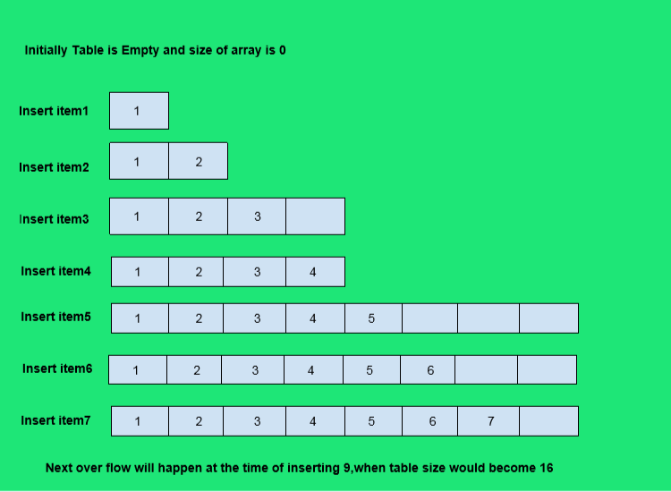
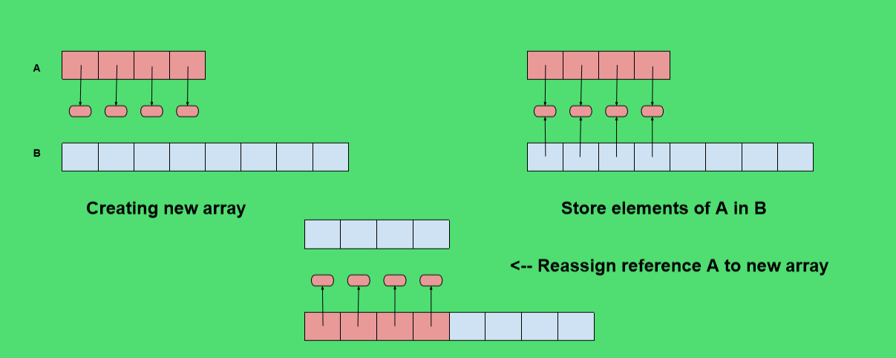

## What is a dynamic array?

A dynamic array is similar to an array, but with the difference that its size can be dynamically modified at runtime. Don’t need to specify how much large an array beforehand. The elements of an array occupy a contiguous block of memory, and once created, its size cannot be changed. A dynamic array can, once the array is filled, allocate a bigger chunk of memory, copy the contents from the original array to this new space, and continue to fill the available slots.

### Dynamic Array Logic Implementation:
The key is to provide means to grows an array A that stores the elements of a list. We can’t actually grow the array, its capacity is fixed. If an element is appended to a list at a time, when the underlying array is full, we need to perform following steps.

Allocate a new array B with larger capacity (A commonly used rule for the new array is to have twice the capacity of the existing array )

Set B[i]=A[i], for i=0 to n-1 where n denotes the current no of items.

Set A=B that is, we hence forth use B as the array of supporting list.

Insert new element in the new array.

